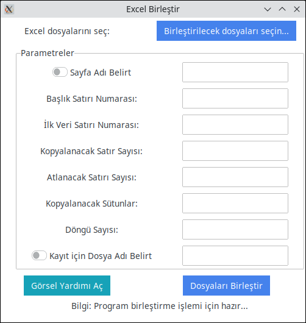
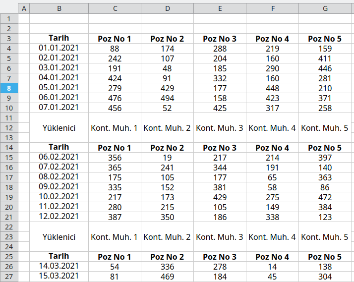
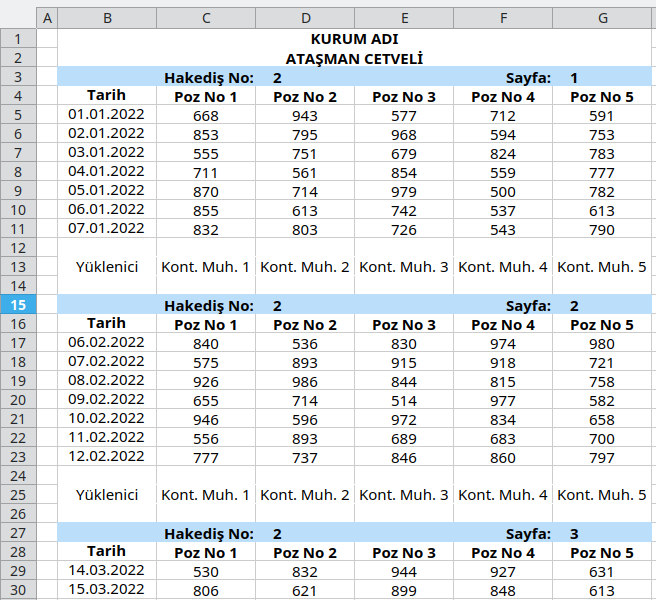
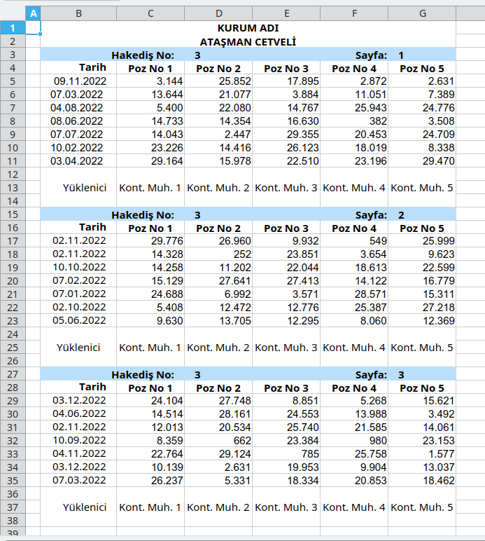
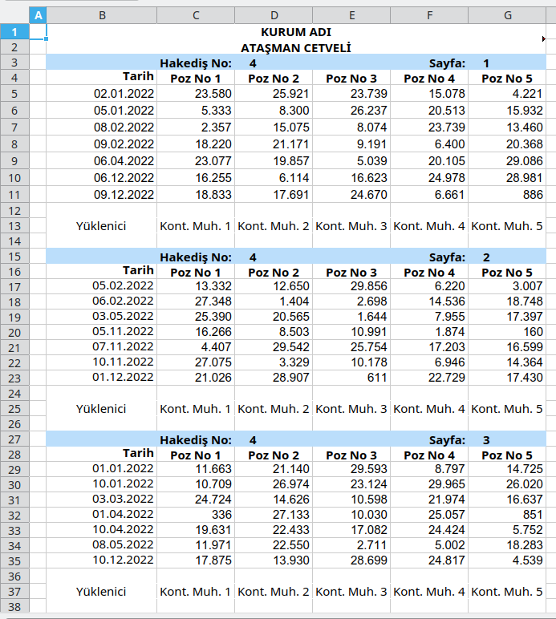
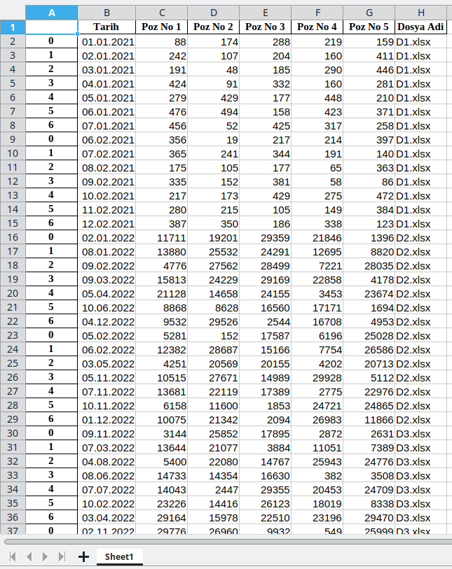

# Excel Birlestir (Excel Merge)
Bu repoda bulunan kodlar ile seçilen klasörde bulunan tüm **Excel (.xls ve .xlsx)** dosyalarının içeriklerini, belirleyeceğimiz parametrelere göre (belirli satır ve sütunlardaki değerleri seçerek) birlestirilebiliriz.

# İÇİNDEKİLER
1. [UYGULAMA ARABİRİMİ](#1)
2. [ÖRNEK EXCEL DOSYALARI](#2)
3. [PARAMETRELER](#3)
4. [SONUÇ](#4)


<a id="1"></a><br>
## UYGULAMA ARABİRİMİ
Uygulamanın arabirimi aşağıdaki gibidir.



**Görsel Yardımı Aç** butonuna bastığımızda aşağıdaki görüntü açılır.

Görsel yardım resmine bakarsanız, birleşim içi için hangi parametrelerin belirtilmesi gerektiğini rahatlıkla anlayabilirsiniz.


<a id="2"></a><br>
## ÖRNEK EXCEL DOSYALARI

Elimizde, aşağıdakine benzer içerikli aynı formatta (biçimde) Excel dosyaları olduğunu varsayalım.


**D1.xlsx dosya içeriği:**



**D2.xlsx dosya içeriği:**



**D3.xlsx dosya içeriği:**



**D4.xls dosya içeriği:**



Bu anlatımda 4 adet dosya (**D1.xlsx, D2.xlsx, D3.xlsx** ve **D4.xls**) kullanılmıştır.

<a id="3"></a><br>
## PARAMETRELER
### Parametre Detayları:

* **Sayfa Adı Belirt**	 : Birleştirme için excel dosyasındaki hangi sayfadaki (sekmedeki) verilerin seçileceğini belirttiğimiz parametre. (örneğin: "Sayfa1") Eğer bu ayar pasif bırakılırsa, excel dosyalarının **İLK Sekmesinde (ilk çalışma sayfasındaki)** veriler birleştirilecektir.

* **Başlık Satırı Numarası** : Excel dosyasında başlık olarsak kullanılacak olan satır numarasını belirtmelisiniz. Geçerli Tamsayı değeri olmalı (örneğin: 4 )

* **İlk Veri Satırı Numarası** : Excel dosyasında ilk Verinin seçilmesi için kaç satır atlamak (görmezden gelmek) istediğimizi belirttiğimiz parametre. Tamsayı değeri olmalı (örneğin: 5 )

* **Veri Barındıran Satır Sayısı** : Excel dosyasında kaç satırlık verinin seçilmesi gerektiğini belirttiğimiz parametre. Tamsayı değeri olmalı (örneğin: 7 )

* **Silinecek Satır Sayısı** : İlk veri seçildikten sonra, ikinci veri için kaç satır veriyi atlamak (görmezden gelmek) istediğimizi belirttiğimiz parametre. Tamsayı değeri olmalı (örneğin: 5 )


* **Kopyalanacak Sütunlar**  : Excel dosyasında kopyalanacak verilerin hangi sütun aralığında olduğunu belirttiğimiz parametre. (örneğin: "B:G" )

**<u>NOT:</u>** **Veri Barındıran Satır Sayısı** ve **Silinecek Satır Sayısı** değerleri ardışık olarak düzenli bir şekilde devam etmelidir. Yani İlk veri gurubu 7 satırdan oluşup ardından 5 satır silinecek veri bulunuyorsa, yapı sürekli bu şekilde (7-5 - 7-5 - 7-5, ...) devam etmelidir.

<a id="4"></a><br>
## SONUÇ

**Program çalıştırıldığında elde edeceğimiz sonuç aşağıdaki gibidir:**

**Konsol çıktısı:**

```python
        Tarih Poz No 1 Poz No 2 Poz No 3 Poz No 4 Poz No 5 Dosya Adi
0 2021-01-01       88      174      288      219      159   D1.xlsx
1 2021-01-02      242      107      204      160      411   D1.xlsx
2 2021-01-03      191       48      185      290      446   D1.xlsx
3 2021-01-04      424       91      332      160      281   D1.xlsx
4 2021-01-05      279      429      177      448      210   D1.xlsx
5 2021-01-06      476      494      158      423      371   D1.xlsx
6 2021-01-07      456       52      425      317      258   D1.xlsx
0 2021-02-06      356       19      217      214      397   D1.xlsx
1 2021-02-07      365      241      344      191      140   D1.xlsx
2 2021-02-08      175      105      177       65      363   D1.xlsx
3 2021-02-09      335      152      381       58       86   D1.xlsx
4 2021-02-10      217      173      429      275      472   D1.xlsx
5 2021-02-11      280      215      105      149      384   D1.xlsx
6 2021-02-12      387      350      186      338      123   D1.xlsx
0 2022-01-02    11711    19201    29359    21846     1396   D2.xlsx
1 2022-01-08    13880    25532    24291    12695     8820   D2.xlsx
2 2022-02-09     4776    27562    28499     7221    28035   D2.xlsx
3 2022-03-09    15813    24229    29169    22858     4178   D2.xlsx
4 2022-04-05    21128    14658    24155     3453    23674   D2.xlsx
5 2022-06-10     8868     8628    16560    17171     1694   D2.xlsx
6 2022-12-04     9532    29526     2544    16708     4953   D2.xlsx
0 2022-02-05     5281      152    17587     6196    25028   D2.xlsx
1 2022-02-06    12382    28687    15166     7754    26586   D2.xlsx
2 2022-05-03     4251    20569    20155     4202    20713   D2.xlsx
3 2022-11-05    10515    27671    14989    29928     5112   D2.xlsx
4 2022-11-07    13681    22119    17389     2775    22976   D2.xlsx
5 2022-11-10     6158    11600     1853    24721    24865   D2.xlsx
6 2022-12-01    10075    21342     2094    26983    11866   D2.xlsx
0 2022-11-09     3144    25852    17895     2872     2631   D3.xlsx
1 2022-03-07    13644    21077     3884    11051     7389   D3.xlsx
2 2022-08-04     5400    22080    14767    25943    24776   D3.xlsx
3 2022-06-08    14733    14354    16630      382     3508   D3.xlsx
4 2022-07-07    14043     2447    29355    20453    24709   D3.xlsx
5 2022-02-10    23226    14416    26123    18019     8338   D3.xlsx
6 2022-04-03    29164    15978    22510    23196    29470   D3.xlsx
0 2022-11-02    29776    26960     9932      549    25999   D3.xlsx
1 2022-11-02    14328      252    23851     3654     9623   D3.xlsx
2 2022-10-10    14258    11202    22044    18613    22599   D3.xlsx
3 2022-02-07    15129    27641    27413    14122    16779   D3.xlsx
4 2022-01-07    24688     6992     3571    28571    15311   D3.xlsx
5 2022-10-02     5408    12472    12776    25387    27218   D3.xlsx
6 2022-06-05     9630    13705    12295     8060    12369   D3.xlsx
0 2022-12-03    24104    27748     8851     5268    15621   D3.xlsx
1 2022-06-04    14514    28161    24553    13988     3492   D3.xlsx
2 2022-11-02    12013    20534    25740    21585    14061   D3.xlsx
3 2022-09-10     8359      662    23384      980    23153   D3.xlsx
4 2022-11-04    22764    29124      785    25758     1577   D3.xlsx
5 2022-12-03    10139     2631    19953     9904    13037   D3.xlsx
6 2022-03-07    26237     5331    18334    20853    18462   D3.xlsx
0 2022-01-02    23580    25921    23739    15078     4221   D4.xls
1 2022-01-05     5333     8300    26237    20513    15932   D4.xls
2 2022-02-08     2357    15075     8074    23739    13460   D4.xls
3 2022-02-09    18220    21171     9191     6400    20368   D4.xls
4 2022-04-06    23077    19857     5039    20105    29086   D4.xls
5 2022-12-06    16255     6114    16623    24978    28981   D4.xls
6 2022-12-09    18833    17691    24670     6661      886   D4.xls
0 2022-02-05    13332    12650    29856     6220     3007   D4.xls
1 2022-02-06    27348     1404     2698    14536    18748   D4.xls
2 2022-05-03    25390    20565     1644     7955    17397   D4.xls
3 2022-11-05    16266     8503    10991     1874      160   D4.xls
4 2022-11-07     4407    29542    25754    17203    16599   D4.xls
5 2022-11-10    27075     3329    10178     6946    14364   D4.xls
6 2022-12-01    21026    28907      611    22729    17430   D4.xls
0 2022-01-01    11663    21140    29593     8797    14725   D4.xls
1 2022-01-10    10709    26974    23124    29965    26020   D4.xls
2 2022-03-03    24724    14626    10598    21974    16637   D4.xls
3 2022-04-01      336    27133    10030    25057      851   D4.xls
4 2022-04-10    19631    22433    17082    24424     5752   D4.xls
5 2022-05-08    11971    22550     2711     5002    18283   D4.xls
6 2022-12-10    17875    13930    28699    24817     4539   D4.xls
0 2022-03-03    26428     9034    19923    16535     2179   D4.xls
1 2022-05-09     7663     1380    13615    21561    22757   D4.xls
2 2022-07-07    23808      561     8496    28120    28459   D4.xls
3 2022-07-08    11814    19338    14260     8458    18332   D4.xls
4 2022-08-08    18907    26688    14247    20569     6083   D4.xls
5 2022-09-07    14573    19072    24204     2050     6417   D4.xls
6 2022-11-05    23860     3043     9807    15361     4656   D4.xls


```

**Birleştirilmiş Excel dosyası Görüüntüsü**



### NOT:
Dikkat ettiyseniz en sağdaki Sütuna, birleştirme işlemi sonrası, verilerin hangi dosyadan alındığına dair bilgi de eklendi. Sorun yaşanması halinde sorunun hangi dosyadan kaynaklandığını tespit etme adına faydalı olacağı düşünülerek eklenmiştir.


