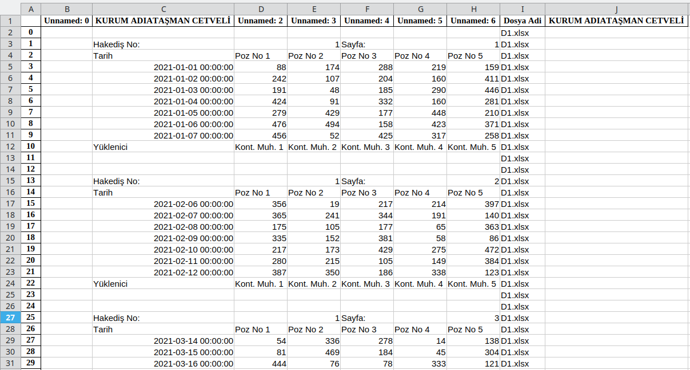
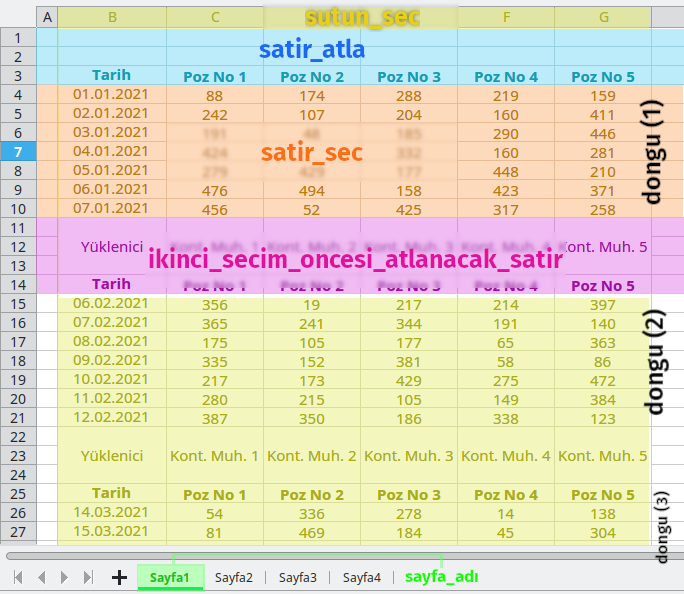
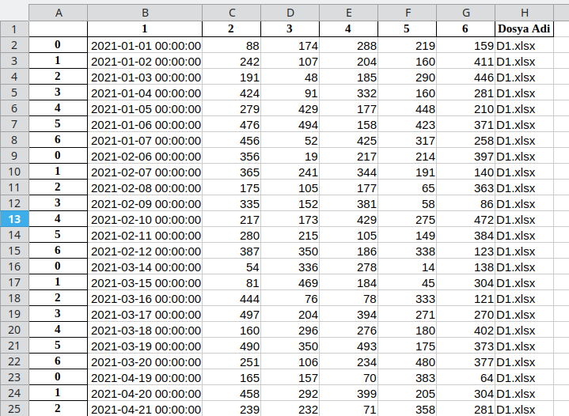

# Excel_Birlestir
Excel Birlestir (Excel Merge) kodları ile Excel (.xls ve .xlsx) ve Libre Ofis Calc (.ods) dosyalarının içeriklerini tamamen ya da belirli kriterler belirtilerek bazı satır ve sütundaki değerleri seçerek birlestirilebilirsiniz.

Elimizde, aşağıdakine benzer içerikli aynı formatta (biçimde) Excel ve/veya LibreOfis dosyaları olduğunu varsayalım. 

**D1.xlsx dosya içeriği:**

**D2.ods dosya içeriği:**

Bu anlatımda 4 adet dosya (**D1.xlsx, D2.ods, D3.ods** ve **D4.ods**) kullanılmıştır.

## Excel_Birlestir.py Dosyası:
**Excel_Birlestir.py** dosyasındaki kodu çalıştırdığınızda, aynı dizin (klasör) içerisindeki tüm Excel ve LibreOfis dosyalarının içeriği, **pandas** kütüphanesi aracılığı ile birleştirilir ve **TUMU.xlsx** isimli dosyada toplanır. Kod tekrar çalıştırıldığında TUMU.xlsx dosyası otomatik olarak silinir ve birleştirme işlemi sonunda yeniden oluşturulur.

Tüm içeriği Birleştirilen dosyaların toplandığı **TUMU.xlsx** dosyanın içeriği aşağıdaki gibi olur. Aşağıdaki resme bakarsanız, TUMU.xlsx dosya içeriğinin rahat görünebilmesi amacıyla bazı satırlar gizlenmiş durumdadır. Birleştirme işlemi gerçekleşirken hangi verinin hangi dosyadan kopyalandığının belirtilmesi amacıyla en son sütuna **Dosya Adi** isimli sütun eklenir ve hücrelere dosya isimleri yazdırılır.

## Excel_Verilerini_Duzenle_Basliksiz.py Dosyası:
**Excel_Verilerini_Duzenle_Basliksiz.py** dosyası, belirtilen excel dosyası içerisindeki verileri, başlıksız yani sadece verilerin altalta toplanması için kullanılan python kodunu barındırır.

**Excel_Verilerini_Duzenle_Basliksiz.py** dosyasını çalıştırmadan önce excel dosyası içerisinde, verilerin nerede olduğunu belirtmeniz gerekir.

Aşağıdaki resme bakarsanız, dosyadaki hangi parametrelerin belirtilmesi gerektiğini rahatlıkla anlayabilirsiniz.

### Parametre detayları:
* **DosyaAdi**  : Hangi Excel dosyasındaki verilerin altalta toplamasını istediğimizi belirttiğimiz parametre. (örneğin: "D1.xlsx")
* **sayfa_adi**	 : Birleştirme için excel dosyasındaki hangi sayfadaki (sekmedeki) verilerin seçileceğini belirttiğimiz parametre. (örneğin: "Sayfa1")
* **satir_atla** : Excel dosyasında ilk Verinin seçilmesi için kaç satır atlamak (görmezden gelmek) istediğimizi belirttiğimiz parametre. Tamsayı değeri olmalı (örneğin: 3 )
* **satir_sec**  : Excel dosyasında kaç satırlık verinin seçilmesi gerektiğini belirttiğimiz parametre. Tamsayı değeri olmalı (örneğin: 7 )
* **sutun_sec**  : Excel dosyasında kopyalanacak verilerin hangi sütun aralığında olduğunu belirttiğimiz parametre. (örneğin: "B:G" )
* **ikinci_secim_oncesi_atlanacak_satir** : İlk veri seçildikten sonra, ikinci veri için kaç satır veriyi atlamak (görmezden gelmek) istediğimizi belirttiğimiz parametre. Tamsayı değeri olmalı (örneğin: 4 )
* **dongu** : Excel dosyasında kopyalanacak veri kümesinden kaç adet olduğunu, yani kopyalama döngüsünün kaç kez tekrarlanmasını istediğimizi belirttiğimiz parametre. Tamsayı değeri olmalı. Büyük değer belirtmek sorun oluşturmaz. Küçük değer belirtilirse, yeteri kadar veri kopyalanamaz. (örneğin: 20 )

**Excel_Verilerini_Duzenle_Basliksiz.py** dosyası çalıştırıldıktan sonra Tüm veriler alt alta toplandıktan sonra sonuç "Basliksiz_DosyaAdi" ismi ile kaydedilir.

**D1.xlsx** dosyasını çalıştırdığımızda oluşan **Basliksiz_D1.xlsx** dosyasının içeriği aşağıdaki gibidir;

